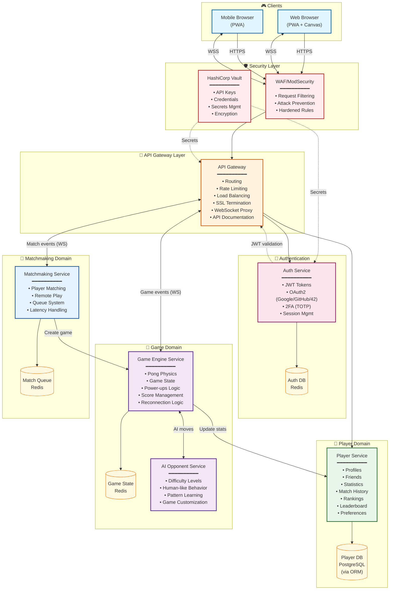

```mermaid
---
config:
  layout: dagre
---
flowchart TB
 subgraph Clients["🎮 Clients"]
        Browser["Web Browser<br>(PWA + Canvas)"]
        Mobile["Mobile Browser<br>(PWA)"]
  end
 subgraph Security["🛡️ Security Layer"]
        WAF["WAF/ModSecurity<br>━━━━━━━━━━<br>• Request Filtering<br>• Attack Prevention<br>• Hardened Rules"]
        Vault["HashiCorp Vault<br>━━━━━━━━━━<br>• API Keys<br>• Credentials<br>• Secrets Mgmt<br>• Encryption"]
  end
 subgraph Gateway["🚪 API Gateway Layer"]
        APIGW["API Gateway<br>━━━━━━━━━━<br>• Routing<br>• Rate Limiting<br>• Load Balancing<br>• SSL Termination<br>• WebSocket Proxy<br>• API Documentation"]
  end
 subgraph Auth["🔐 Authentication"]
        AuthService["Auth Service<br>━━━━━━━━━━<br>• JWT Tokens<br>• OAuth2 (Google/GitHub/42)<br>• 2FA (TOTP)<br>• Session Mgmt"]
        AuthDB[("Auth DB<br>Redis")]
  end
 subgraph PlayerDomain["👤 Player Domain"]
        PlayerService["Player Service<br>━━━━━━━━━━<br>• Profiles<br>• Friends<br>• Statistics<br>• Match History<br>• Rankings<br>• Leaderboard<br>• Preferences"]
        PlayerDB[("Player DB<br>PostgreSQL<br>(via ORM)")]
  end
 subgraph GameDomain["🏓 Game Domain"]
        GameEngine["Game Engine Service<br>━━━━━━━━━━<br>• Pong Physics<br>• Game State<br>• Power-ups Logic<br>• Score Management<br>• Reconnection Logic"]
        GameState[("Game State<br>Redis")]
        AIService["AI Opponent Service<br>━━━━━━━━━━<br>• Difficulty Levels<br>• Human-like Behavior<br>• Pattern Learning<br>• Game Customization"]
  end
 subgraph MatchDomain["🎯 Matchmaking Domain"]
        MatchService["Matchmaking Service<br>━━━━━━━━━━<br>• Player Matching<br>• Remote Play<br>• Queue System<br>• Latency Handling"]
        MatchDB[("Match Queue<br>Redis")]
  end
    Browser -- HTTPS --> WAF
    Browser <-- WSS --> WAF
    Mobile -- HTTPS --> WAF
    Mobile <-- WSS --> WAF
    WAF --> APIGW
    Vault -. Secrets .-> AuthService & APIGW
    APIGW --> AuthService & PlayerService
    APIGW <-- Game events (WS) --> GameEngine
    APIGW <-- Match events (WS) --> MatchService
    AuthService --> AuthDB
    AuthService -. JWT validation .-> APIGW
    PlayerService --> PlayerDB
    GameEngine --> GameState
    GameEngine -- Update stats --> PlayerService
    GameEngine <-- AI moves --> AIService
    MatchService --> MatchDB
    MatchService -- Create game --> GameEngine

     Browser:::client
     Mobile:::client
     WAF:::security
     Vault:::security
     APIGW:::gateway
     AuthService:::auth
     AuthDB:::db
     PlayerService:::player
     PlayerDB:::db
     GameEngine:::game
     GameState:::db
     AIService:::game
     MatchService:::match
     MatchDB:::db
    classDef client fill:#e1f5fe,stroke:#01579b,stroke-width:2px
    classDef security fill:#ffebee,stroke:#b71c1c,stroke-width:2px
    classDef gateway fill:#fff3e0,stroke:#e65100,stroke-width:2px
    classDef auth fill:#fce4ec,stroke:#880e4f,stroke-width:2px
    classDef player fill:#e8f5e9,stroke:#1b5e20,stroke-width:2px
    classDef chat fill:#e0f7fa,stroke:#006064,stroke-width:2px
    classDef game fill:#f3e5f5,stroke:#4a148c,stroke-width:2px
    classDef match fill:#e3f2fd,stroke:#0d47a1,stroke-width:2px
    classDef monitoring fill:#fff9c4,stroke:#f57f17,stroke-width:2px
    classDef db fill:#fff8e1,stroke:#ff6f00,stroke-width:1px
```