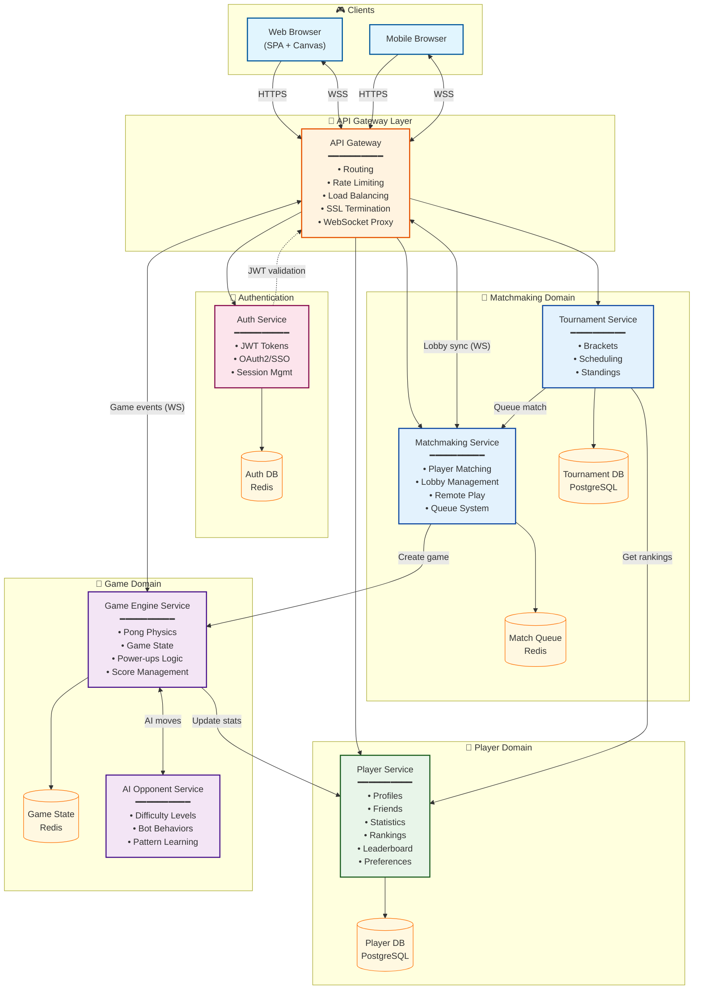

```mermaid
---
config:
  layout: dagre
---
flowchart TB
    subgraph Clients["🎮 Clients"]
        Browser["Web Browser<br/>(SPA + Canvas)"]
        Mobile["Mobile Browser"]
    end

    subgraph Gateway["🚪 API Gateway Layer"]
        APIGW["API Gateway<br/>━━━━━━━━━━<br/>• Routing<br/>• Rate Limiting<br/>• Load Balancing<br/>• SSL Termination<br/>• WebSocket Proxy"]
    end

    subgraph Auth["🔐 Authentication"]
        AuthService["Auth Service<br/>━━━━━━━━━━<br/>• JWT Tokens<br/>• OAuth2/SSO<br/>• Session Mgmt"]
        AuthDB[("Auth DB<br/>Redis")]
    end

    subgraph PlayerDomain["👤 Player Domain"]
        PlayerService["Player Service<br/>━━━━━━━━━━<br/>• Profiles<br/>• Friends<br/>• Statistics<br/>• Rankings<br/>• Leaderboard<br/>• Preferences"]
        PlayerDB[("Player DB<br/>PostgreSQL")]
    end

    subgraph GameDomain["🏓 Game Domain"]
        GameEngine["Game Engine Service<br/>━━━━━━━━━━<br/>• Pong Physics<br/>• Game State<br/>• Power-ups Logic<br/>• Score Management"]
        GameState[("Game State<br/>Redis")]
        AIService["AI Opponent Service<br/>━━━━━━━━━━<br/>• Difficulty Levels<br/>• Bot Behaviors<br/>• Pattern Learning"]
    end

    subgraph MatchDomain["🎯 Matchmaking Domain"]
        MatchService["Matchmaking Service<br/>━━━━━━━━━━<br/>• Player Matching<br/>• Lobby Management<br/>• Remote Play<br/>• Queue System"]
        MatchDB[("Match Queue<br/>Redis")]
        TournamentService["Tournament Service<br/>━━━━━━━━━━<br/>• Brackets<br/>• Scheduling<br/>• Standings"]
        TournamentDB[("Tournament DB<br/>PostgreSQL")]
    end

    %% Client to Gateway
    Browser -->|HTTPS| APIGW
    Browser <-->|WSS| APIGW
    Mobile -->|HTTPS| APIGW
    Mobile <-->|WSS| APIGW

    %% Gateway to Services
    APIGW --> AuthService
    APIGW --> PlayerService
    APIGW --> MatchService
    APIGW --> TournamentService
    APIGW <-->|"Game events (WS)"| GameEngine
    APIGW <-->|"Lobby sync (WS)"| MatchService

    %% Auth flows
    AuthService --> AuthDB
    AuthService -.->|"JWT validation"| APIGW

    %% Data access
    PlayerService --> PlayerDB
    GameEngine --> GameState

    %% Inter-service communication (labeled)
    GameEngine -->|"Update stats"| PlayerService
    GameEngine <-->|"AI moves"| AIService
    MatchService --> MatchDB
    MatchService -->|"Create game"| GameEngine
    TournamentService --> TournamentDB
    TournamentService -->|"Queue match"| MatchService
    TournamentService -->|"Get rankings"| PlayerService

    %% Styling
    classDef client fill:#e1f5fe,stroke:#01579b,stroke-width:2px
    classDef gateway fill:#fff3e0,stroke:#e65100,stroke-width:2px
    classDef auth fill:#fce4ec,stroke:#880e4f,stroke-width:2px
    classDef player fill:#e8f5e9,stroke:#1b5e20,stroke-width:2px
    classDef game fill:#f3e5f5,stroke:#4a148c,stroke-width:2px
    classDef match fill:#e3f2fd,stroke:#0d47a1,stroke-width:2px
    classDef db fill:#fff8e1,stroke:#ff6f00,stroke-width:1px

    class Browser,Mobile client
    class APIGW gateway
    class AuthService auth
    class AuthDB db
    class PlayerService player
    class PlayerDB db
    class GameEngine game
    class GameState db
    class AIService game
    class MatchService match
    class MatchDB db
    class TournamentService match
    class TournamentDB db
```